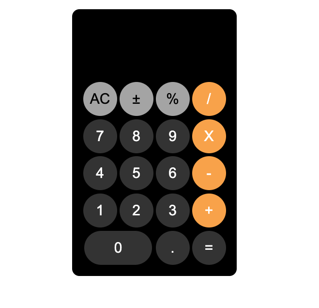

# TW-04 : Calculator Design

Live at: https://umutplvn.github.io/Calculator/

## Description

Project aims to design a caclulator.


```
Caclulator (folder)
|
|----readme.md                   
|----images               
|----solution
        |----index.html  
        |----style.css   
```

## Expected Outcome




>>Part-1 HTML Structure

	- Creat structure of the HTML5
	- Give name of your project (title)
	- Create the main structur of the HTML

>>Part-2 CSS Structure

	- Set a background
	- Set container background color and margin
	- Define others color-size-padding etc...

- Step 4: Push your application into your own public repo on Github

- Step 5: Deploy your application on Github template to showcase your app within your team.

## Notes

- You can use HTML,and CSS to complete this project.
